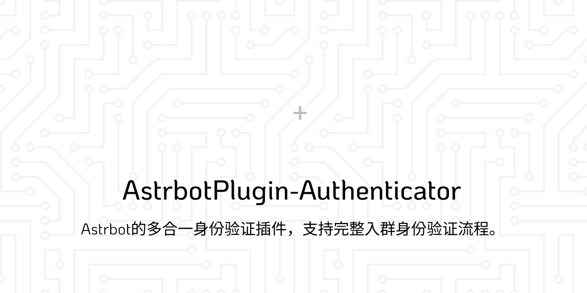

这是一个强大的身份验证插件，旨在提供一个完整的身份验证流程系统以实现全自动筛选人机~~和部分智力低下的类人~~。

## 功能

- **详细的插件配置，可自定义绝大部分内容**
- 支持群聊白名单，避免在意外群聊中触发验证
- 模块化设计，可自由开关各个功能
- 基于关键词的加群请求审核
  - 支持等级限制，仅允许指定等级以上的用户申请入群
  - 支持设定延迟，降低风控风险
- 通过简易验证判断入群者是否为人机
- 黑名单功能
  - 支持自动拒绝黑名单用户的加群请求
  - 支持忽略黑名单用户的消息
  - ~~支持自动踢出黑名单用户~~

## 安装

在 Astrbot WebUI 插件页面点击`安装`按钮，选择`从链接安装`，复制粘贴本仓库 URL 并点击安装即可。

> [!Warning]
> 此插件仅保证可在 NapCat 作为 aiocqhttp 适配器时可用。

## 使用

插件安装后默认不启用任何功能，在插件配置中开启你需要的功能即可开始使用。

> [!Note]
> 使用此插件的机器人账号需要为你指定群聊的管理员。\
> 插件不会检测当前账号在触发操作的群聊是否为管理员。

## 配置

### 配置占位符定义

`SimpleReCAPTCHA_MessageConfig`通用：
- **{at_user}**：@目标用户。
- **{member_name}**：目标用户的昵称。
- **{question}**：当前验证题目。

仅`MessageConfig_Join`可用：
- **{timeout}**：验证超时时间，这将自动转为分钟。

仅`RateLimitConfig_RejectReason`可用：
- **{time}**：加群速率限制时间，可在`RateLimitConfig_Time`中设置该值。
- **{Unit}**：加群速率限制时间单位，可在`RateLimitConfig_Unit`中设置。

仅`NotificationConfig_MessageTemplate`可用：
- **{group_id}**：加群请求事件所在的群号。
- **{user_name}**：被拒绝加群的用户昵称。
- **{user_id}**：被拒绝加群的用户 QQ 号。
- **{reason}**：拒绝加群的理由。
- **{time}**：拒绝加群的时间。

## 鸣谢

- **[DeepSeek](https://chat.deepseek.com)** 本项目大部分的代码都是 AI 编写，后续维护也交由 AI 维护。
- **[qiqi55488](https://github.com/qiqi55488)** 本项目主要功能模块之一参考自[这位开发者的插件](https://github.com/qiqi55488/astrbot_plugin_appreview)。
- **[huntuo146](https://github.com/huntuo146)** 本项目主要功能模块之一参考自[这位开发者的插件](https://github.com/huntuo146/astrbot_plugin_Group-Verification_PRO)。